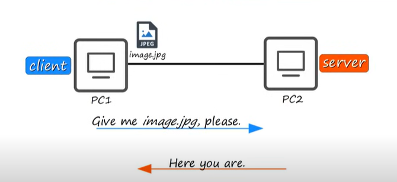
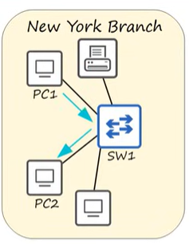
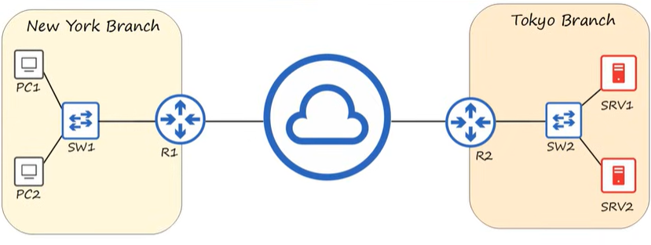
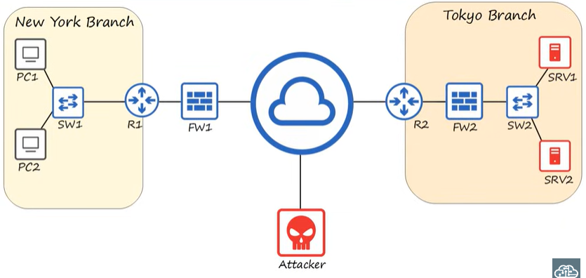

# Day 1: Network Devices

1. What is a network ? 
   
Trên wikipedia, network được định nghĩa như sau: "A computer network is a digital telecommunications network which allows nodes to share resources". 

2. Client and server

Clients đuọc định nghĩa là một thiết bị có thể tiếp hoặc kết nối một dịch vụ vào đó được thực hiển bởi server.

Server là một thiết bị cung cấp những chức năng hoặc dịch vụ dành cho các clients. 

Lưu ý rằng ở một số hoàn cảnh thì server cũng có thể là client và client cũng có thể là server. Một thiết bị được coi là client cũng có thể thực hiện tác vụ như là một server và ngược lại. 

3. Switches 

Thông thường để gửi dữ liệu cho nhau 2 PC sẽ không được nối dây với nhau mà cần phải nối thông qua một thiết bị được gọi là switch. Switch được dùng để forward traffic trong một mạng LAN (Local Area Network).

Như trong hình trên những thiết bị kết nối vào cùng một switch có thể gửi dữ liệu cho nhau thông qua switch. Một switch sẽ có nhiết interface để các thiết bị khác có thể kết nối đến. Tuy nhiêu switches không thể kết nối trực tiếp đến internet hoặc truyền dữ liệu giữa 2 mạng LAN. 

4. Router 

Tiếp theo ta sẽ đến với một thiết bị khác được gọi là router. Router thực hiện những nhiệm vụ và switch không làm được như là chuyển tiếp các gói tin ở 2 mạng LAN khác nhau và có thể kết nối trực tiếp đến internet. Ví dụ như PC1 muốn gửi một file đến cho SRV1 thì nó phải gửi request đến cho R1 thông qua SW1, R1 sẽ forward traffic đến cho R2, rồi cuối cùng R2 sẽ thực hiện gửi bản tin cho SRV1 thông qua SW2. Ngoài ra còn có một điểm khác cơ bản đó chính là router sẽ có ít interface hơn switch.

5 Firewalls

Firewalls là một network security devices có thể điều khiển network traffic đi vào và đi ra khỏi mạng. Firewalls có thể đứng trước router hoặc có thể đứng sau router. Firewall sẽ thực hiện nhiệm vụ bảo vệ các end hosts ở bên trong như là PC hay server trong một network.

Firewalls phải được cấu hình security rules để có thể xác định xem network traffic nào được cho phép và network traffic nào không được cho phép. Nếu muốn gửi gói tin từ New York sang Tokyo như hình trên thì firewalls phải được cấu hình những rules cho phép bản tin từ New York đi qua và ngược lại.

Thực tế ta thường gặp phải 2 loại firewalls:

- Network firewalls: là các thiết bị phần cứng có thể lọc được những traffic giữa các networks
- Host-based firewalls: là một ứng dụng phần mềm thực hiện việc lọc traffic đi vào và đi ra khỏi một host như là một PC. 