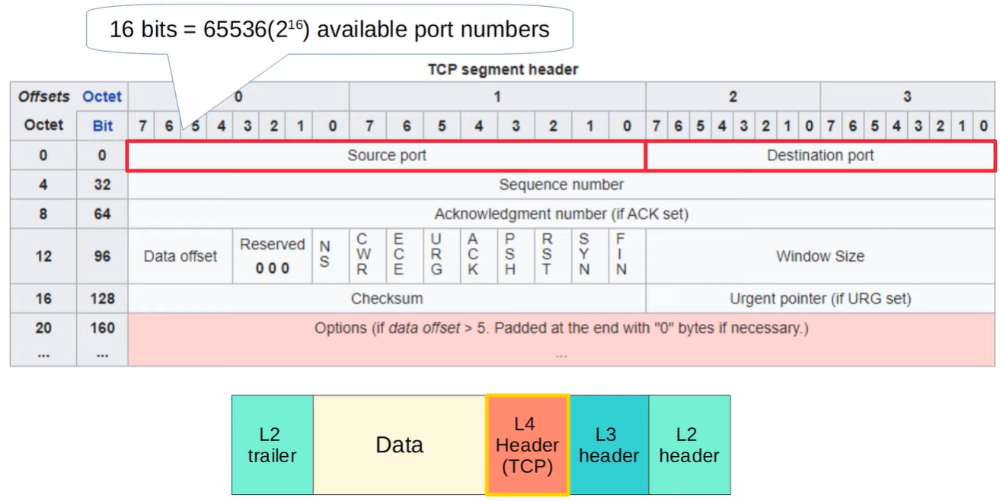

# TCV và UDP
## Functions of Layer 4 (Transport Layer)
- Cung cấp một cách truyền dữ liệu minh bạch giữa các end host.
  
    

    Layer 4 thực hiện chức năng đóng gói gói tin với Layer 4 header và sử dụng những chức năng của các lớp ở bên dưới để có thể thực hiện việc truyền dữ liệu. Các end hosts sẽ không cần phải quan tâm ở bên dưới underlying network thực hiện những việc gì \

- Cung cấp một số dịch vụ cho các ứng dụng như là:
    1. Truyền dữ liệu một cách tin cậy.
    2. Cơ chế tự sửa lỗi trong quá trình truyền dữ liệu.
    3. Data sequencing: Dữ liệu được phân mảnh trong khi truyền Layer 4 sẽ đảm bảo được end host có thể lắp ráp lại dữ liệu kể cả trong trường hợp những mảnh dữ liệu không đến được cùng một lúc.
    4. Điều khiển luồng (flow control) đảm bảo được dữ liệu được truyền không quá nhanh so với tốc độ xử lý của các end host.

- Cung cấp layer 4 addressing (port numbers): port sẽ được nhận dạng bằng các Application Layer Protocol, cung cấp tính năng `session multiflexing` . Port range được thiết kế bởi IANA(Internet Assgined Number Authority). Các **well-known** port numbers: 0-1023 và các **registered** port numbers: 1024-49151 để dùng những port này ta cần phải đăng ký để sử dụng, cuối cùng là **Ephemeral/private/dynamic** port numbers: 49152-65535 host sẽ lựa chọn một cách ngẫu nhiên một port number trong dải này làm souce port
  
  `session`: được hiểu như là một phiên trao đổi dữ liệu giữa 2 hoặc nhiều thiết bị. Ví dụ một PC muốn kết nối đén một SRV1 theo source port là 50000 và dest port là 80 và cũng muốn kết nối đến SRV2 với src port là 60000 và dest port là 21 thì ở đây có thể được hiểu rằng cả hai kết nối này đều cùng một session. Thông thường một PC sẽ có khă năng sử lý nhiều phiên kết nối trong cùng một lúc. 

## TCP (Transmission Control Protocol)

- TCP is connection-oriented (Trước khi gửi dữ liệu đến host đích, 2 host thực hiện trao đổi dữ liệu sẽ khởi tạo một kết nối trước. Một khi kết nối đó được thiết lập thì giai đoạn trao đổi dữ liệu sẽ bắt đầu).
- TCP cung cấp khả năng truyền dữ liệu một cách tin cậy. Vì trong TCP host đích sẽ phải thông báo lại với mỗi TCP segment mà nó đã nhận. Nếu một segment không được thông báo nó sẽ được gửi lại.
- TCP cung cấp `sequencing`: Dữ liệu được phân mảnh trong khi truyền Layer 4 sẽ đảm bảo được end host có thể lắp ráp lại dữ liệu kể cả trong trường hợp những mảnh dữ liệu không đến được cùng một lúc.
- TCP cung cấp `flow control`

### TCP header

Một số lưu ý về TCP header:

- Đầu tiên cả source port và destination port đều có 16 bits( 2^16) địa chỉ ports
- Các trường về Sequence Number hay là Acknowledgement number sẽ cung cấp khả năng sequencing cũng như reliable cho TCP
- TCP có một chuỗi các bit cờ để phục vụ các mục đích khác nhau. Trong đó ta cần chú ý 3 bit cờ là ACK, SYN, FIN, 3 bit cờ này đươc sử dụng để thiết lập và hủy một kết nối TCP. 
- Window Size là trường có tác dụng giúp cho TCP có chức năng điều khiển luồng.

### TCP three-way handshake

Quá trình thực hiện 3 ways handshake được diễn tả như sau:

1. Đầu tiên PC1 gửi một gói tin TCP đến SRV1 với bit cờ SYN được set.
2. Sau khi nhận được gói tin từ PC1, SRV1 tiến hành gửi gói tin TCP cho PC1 với bit cờ SYN và bit cờ ACK được set (set to 1). 
3. Khi nhận được gói tin từ SRV1 thì PC1 gửi tiếp một gói tin cho SRV1 với chỉ một bit ACK được set. Lúc này việc thiết lập kết nối TCP giữa PC1 và SRV1 hoàn tất.

### TCP forr-way handshake

Được sử dụng khi mà PC1 nhận thế rằng không cần thưc hiện kết nối đến SRV1 nữa

Quá trình thực hiện được diễn tả như sau:

1. PC1 gửi một TCP segment với bit cờ FIN được set là 1 
2. Sau đó SRV1 gửi lại gói tin với bit ACK.
3. SRV1 gửi tiếp một gói tin với bit FIN được set.
4. PC1 đáp lại bằng gói tin với bit ACK được set và thực hiện đóng kết nối. 

### TCP sequencing 

Tiếp theo, TCP thực hiện chức năng sequencing như thế nào ?

Quá trình thực hiện sequencing có sự tham gia của 2 trường *Sequence Number* và *Acknowledgement Number* được thể hiện như sau:

1. Đầu tiên để khởi tạo một kết nối TCP như thường lệ cả bên PC và SRV đều phải thực hiện 3 way handshake. Tuy nhiên ở đây ta sẽ đi vào chi tiết các trường về squence number và acknowledgement number được khởi tạo như nào. PC1 sẽ thực hiện khởi tạo giá trị sequence number bằng cách lấy ngẫu nhiên một giá trị, ở đây là 10. 
2. Sau khi nhận được SRV sẽ gửi lại cho PC1 gói tin với trường sequence number cũng là một số ngẫu nhiên (50) và khởi tạo tiếp trường ACK bằng sequence number trong gói tin nhận từ PC cộng với 1 (11). Tại sao lại là 11 bởi vì TCP sử dụng cơ chế `forward Acknowledgement` để nói cho bên PC1 rằng nó mong muốn nhận sequence number ở segment tiếp theo là bao nhiêu. 
3. Cứ tương tự như vậy đến khi gửi hết dữ liệu. 

### TCP retransmission

Một cách đơn giản trong thời gian truyền từ PC1 sang SRV1 hoặc ngược lại mà bị mất gói (do nguyên nhân nào đó như time out hoặc do yếu tố môi trường bên ngoài) PC1 sẽ có cơ chế gửi lại segment đã bị mất sau một khoảng thời gian chờ đợi không nhận được ACK từ phía Server. 

### TCP Flow Control

Một vấn đề được chỉ ra rằng với mỗi một segment được gửi đi đều có một ACK được trả về sau đó mới gửi tiếp thực sự là chưa tối ưu. Vì vậy trường Window Size trong TCP header ra đời để giải quyết điều này. Window Size cho phép việc nhiều data được gửi trước khi nhận được ACK.

Ở đây ta có thể thấy rằng PC hoàn toàn có thể gửi 3 segment cùng một lúc sau đó mói nhận được một ACK phản hồi từ bên phía server. Thuật toán slicing window được sử dụng để có thể điều chỉnh được window size rộng như thế nào. Window size có thể tăng cho đến khi một segment bị drop sau đó có thể tùy chỉnh hẹp lại 