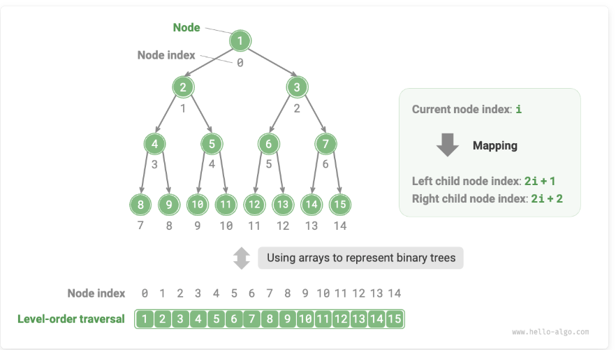

## This folder is all about DSA (DSA)
### Some notes:
1. Array, linked list:
    - Memory is limited and cannot be shared by multiple programs.Arrays are space-efficient because their elements are tightly packed, without requiring extra memory for references (pointers) as in linked lists. However, arrays require pre-allocating a contiguous block of memory, which can lead to waste if the allocated space exceeds the actual need. On the other hand, during program execution, repeated memory allocation and deallocation increase memory fragmentation, reducing memory utilization efficiency.
    -  When the CPU attempts to access data not present in the cache, a **cache miss** occurs, requiring the CPU to retrieve the needed data from slower memory, which can impact performance.
    -  The proportion of successful data retrieval from the cache by the CPU is called the **cache hit** rate.
    -  **Cache lines**: Caches operate by storing and loading data in units called cache lines, rather than individual bytes. This approach improves efficiency by transferring larger blocks of data at once.
    -  **Prefetch mechanism**: Processors predict data access patterns (e.g., sequential or fixed-stride access) and preload data into the cache based on these patterns to increase the cache hit rate.
    - **Spatial locality**: When a specific piece of data is accessed, nearby data is likely to be accessed soon. To leverage this, caches load adjacent data along with the requested data, improving hit rates.
    - **Temporal locality**: If data is accessed, it's likely to be accessed again in the near future. Caches use this principle to retain recently accessed data to improve the hit rate.
2. Trees:
    - The level of a node: It increases from top to bottom, with the root node being at level 1.
    - The height of a binary tree: The number of edges from the root node to the farthest leaf node.
    - The depth of a node: The number of edges from the root node to the node.
    - The height of a node: The number of edges from the farthest leaf node to the node.
    - Binary tree traversal:
      - Level-order traversal: level-order traversal traverses the binary tree from top to bottom, layer by layer. Within each level, it visits nodes from left to right.
      - Preorder, inorder and postorder which embodies a "proceed to the end first, then backtrack and continue 
       
    - Given a perfect binary tree, we store all nodes in an array according to the order of level-order traversal, where each node corresponds to a unique array index. Based on the characteristics of level-order traversal, we can deduce a "mapping formula" between the index of a parent node and its children: If a node's index is **i** then the index of its left child is **2i + 1** and the right child is **2i + 2**. 
      
    

### Reference: 
- https://www.hello-algo.com/