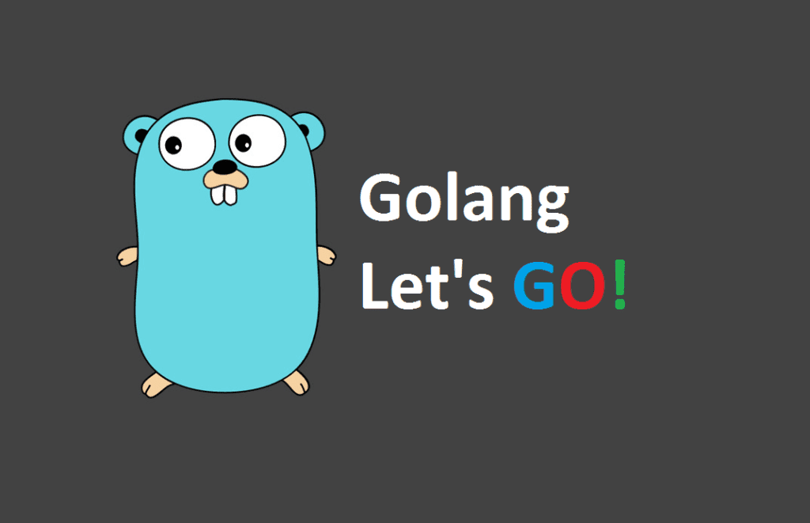

# Go programming note make by dungad2k2
<div style="text-align: center;">
  
</div>


## Chapter 1: Programming a Computer

Provide some basic knowledge about computer

### Computer and its components:

A Computer is consists of 4 main parts:
- The **memory unit** (MU): where data and programs are stored.
   - For instance, we can store into the memory unit the grades of a college class,....
- The **arithmetic and logic unit** (ALU): perform arithmetic and logical operations on data stored into the memory unit. This unit can perform for instance additions, incrementations, decrementations,...
   - Ex: When you need find sum of 2 integer, ALU will execute add operation.
- The **input and output unit (I/OU)** will be charge of loading data into the memory unit from an input device. This unit also sends data from the memory unit to an output device
- The **control unit** will receive instructions from programs and will control the activity of the other units. 

### Memory: 
A computer is composed of two types of memory: 
- The central memory
- The auxiliary memory
  
Two categories of memory exist:
- Volatile
- Non volatile

1. The central memory:
This type of memory is necessary to run the operating systems and all the other programs your computer will run. The central memory contains two types of storage: 
   - RAM (Random Access Memory): when you turn off computer the memory contained in this type of storage will be erased. The operating system and the programs you use will be loaded into this memory -> **volatile**
   - ROM (Read-only memory): contains data necessary for the computer to run correctly. This kind of memory is **not volatile** (when turn of compute, data will not be erased). It's designed to be only readable and not updated by the system.
2. The auxiliary memory: 
This type of memory is **not volatile**. When the power is going off, the data stored will not be earased. Some of auxiliary memory such as: CD-ROM, DVD,....Read and writes to this type of memory is **slow** compared to the RAM

### CPU
CPU is standed for **Central Processing Unit**. The CPU is also denoted **processor**. The CPU contains:
- Arithmetic and logic unit (ALU)
- Control unit (CU)

The CPU will be responsible for executing the instructions given by a program. For instance, the program can instruct to perform an addition between two numbers. Those numbers will be retrieved from the memory unit and passed to the ALU. The program might also require performing an I/O operation like reading data from the hard drive and loading it into the RAM for further processing. The CPU will execute those instructions.

### What is a program ?

To make computers do something, we have to feed them with precise instructions. This set of instructions is called "program". 

### How to speak to the machine ?

Intructions that are given to the machine are written with programming languages. Go is a programming language like: C/C++, Java, .....

There are two types of programming languages:
1. Low level
2. High level

Low level programming languages are closer to the processing unit's instructions. Higher-level languages provide constructs that make them easier to learn and to use. Some high-level languages are compiled, others are interpreted and some are in between. When source files are written, the program that they define cannot be executed immediately. The source file needs to be compiled by using a compiler. The compiled will transform source files into an executable. 

## Chapter 2: The Go language

Go was born inside a Google office. Go is an open-source programming language maintanined by its community and a core team of developers working at Google. 

The **objective** of the first Gophers was to make the life of developers easier by: 
- Reducing the build time of programs drastically
- Designing an effective dependency management system
- Building a language that can produce software that scale well on hardware.

### Go key features

- **Concurrency**: A program is concurrent when tasks can be executed out-of-order or in a partial order.

- **Garbage collector**: When we build programs, we need to store data and fetch data from memory. Memory is not an infinite resource. Therefore, the developer must ensure that unused elements stored in memory are destroyed from time to time. The garbage collector's role is to deallocate memory when it is not used anymore. When the language does not have GC. developer has to collect his garbage and free memory that is no longer used.
## Chapter 3: First Go application
### First Go application
Let's create our source file and name it **main.go**
```
package main

import (
    "fmt"
    "time"
)

func main() {
    now := time.Now()
    fmt.Println(now)
}
```

In all files, we must add the **package** declaration. On the second line, **import** is usually followed by an open parenthesis and a list of the program's imported packages. Each package has a name delimited by **double-quotes**. Then we find the declaration of a function named **main** that we will go deeper into the syntax of functions later.
### Compilation
To transformed into a binary from Go file -> we will use `go build` command.
```
go build main.go
./main //Launch main program from binary file
```

## Chapter4: Binary, Decimal and Hexadecimal, Octal, ASCII, UTF8, Unicode, Runes

1. Hexadecimal:

   `"%x"` is the formatting verb for hexadecimal -> we can convert from decimal to hexadecimal using `"%x"`. If we want to represent a number in hexadecimal in your code, add `0x` before the numeral

2. Decimal:

    To print the number in base ten, you can use the verd `"%d"`.

3. Octal

    To print the number in Octal using `"%o"`.

    ```
     package main

     import "fmt"

     func main() {
       n2 := 0x9F4
       fmt.Printf("Decimal : %d\n", n2)

       // n3 is represented using the octal numeral system
       n3 := 02454
       // alternative : n3 := 0o2454

       // convert in decimal
       fmt.Printf("decimal: %d\n", n3)

       // n4 is represented using the decimal numeral system
       n4 := 1324
       // output n4 (decimal) in octal
       fmt.Printf("octal: %o\n", n4)
       // output n4 (decimal) in octal (with a 0o prefix)
       fmt.Printf("octal with prefix : %O\n", n4)

      }
    ```
4. Slice of bytes:
   
     With Go, you can create a slice of bytes. Lots of common standard package functions and methods are taking as arguments slice of bytes. 

     ```
      package main

      import "fmt"

      func main() {
        b := make([]byte, 0)
        b = append(b, 255)
        b = append(b, 10)
        fmt.Println(b)
      }
     ```
     Golang byte type is an alias of uint8. Unit8 means that we can store unsigned (without any signs, so no negative numbers) integers on 8 bits (a byte) of data. So the minimum value is 0 the maximum value is 255 (2^8 -1). So we can append to a byte slice numbers from 0 to 255. If we try to append a number greater than 255 -> Error.

5. Runes:
   Each character has a code point.
   UTF-8 is an encoding technique that can encode more than 1 million characters. With UTF-8, any character is encoded using 1 to 4 bytes.
   A `rune` represent a Unicode code point:
     - Unicode code points are numeric values.
     - By convention, they are always noted with the following format: "U+X" where **X** is hexadecimal representation of the code point and should have four characters.
   ```
     package main

     import "fmt"

     func main(){
       var aRune rune = 'Z'
       fmt.Printf("Unicode Code point of &#39;%c&#39;: %U\n", aRune, aRune)
     }
     // %c represents value of rune type and %U represent value of rune type in hexadecimal.
   ```
   **Note**: In Go, strings are immutable, meaning that they cannot be changed once created. 

## Chapter5: Variable, Constants and basic type

### Basic types of variable

The Go language predeclares a set of basic types that you can use right away into your programs. You can also define your types (we will see it later). For the moment, we will focus only on the most used types:

- Character strings: **string**
- Unsigned integers: **uint**, **uint8**, **uint16**, **uint32**, **uint64**
- Integers: **int**, **int8**, **int16**, **int32**, **int64**
- Booleans: **bool**
- Floating point numbers: **float32**, **float64**

### Variable declaration
  ```
     // Variable declaration without an initializer
     var roomNumber int
     var roomNumber, floorNumber int
     // Variable declaration with an initializer
     var roomNumber int = 123
     var roomNumber, floorNumber int = 154, 3
     var roomNumber, floorNumber = 154, 3 -> Type is not written but Go will give the variable the type of the initialization value
     // Short variable declaration
     roomNumber := 154
  ```

### Constants 
  ```
    const version string = "1.3.2" // Typed constants
    const version = "1.3.2" // Untyped constants
  ```
  Untyped constants default types are:
  - bool (for any boolean value)
  - rune (for any rune value)
  - int (for any integer value)
  - float64 (for any floating-point value)
  - complex128 (for any complex value)
  - string (for any string value)


## Chapter6: Control statements

### Control statement in GO
1. If/else
   ```
     package main

     import (
	     "fmt"
	     "math/rand"
      )

     func main() {
	       ageJohn := rand.Intn(110)
         agePaul := rand.Intn(110)
         if ageJohn > agePaul {
             fmt.Println("John is older than Paul")
         }else if ageJohn == agePaul {
             fmt.Println("Paul ans John are the same age")
         }else{
             fmt.Println("Paul is older than John")
         }
      }
   ```
2. Switch case
   ```
      package main

      import (
	      "fmt"
	      "math/rand"
      )

      func main() {
	        agePaul := rand.Intn(100)
          ageJohn := rand.Intn(100)
          switch {
              case agePaul > ageJohn:
                  fmt.Println("Paul is older than John")
              case agePaul < ageJohn:
                  fmt.Println("Paul is younger than John")
              default:
                  fmt.Println("Paul and John are of the same age")
          }
      }
   ```
**Note:** the switch case is **intensively used** into go programs. It's easy to read and the syntax is also easy to learn

3. For statement
    For statement with a for clause
    ```
    package main

    import (
	   "fmt"
	   "math/rand"
    )
    func main() {
      a := rand.Intn(10)
      for i := 0; i < a; i++{
         fmt.Println("Hello, World!")
      }
    }
    ```
  
   For statement with a singe condition:
   ```
      package main
      import "fmt"
      func main(){
        const emailToSend = 3
        emailSent := 0
        for emailSent < emailToSend{
          fmt.Println("sending email..")
          emailSent++
        }
        fmt.Println("end of program")
      }
   ```
## Chapter7: Functions

### Syntax

   ```
    //
    func function_name(para1, para2,.....)(result_type){
       //funtion boby
    }
   ```