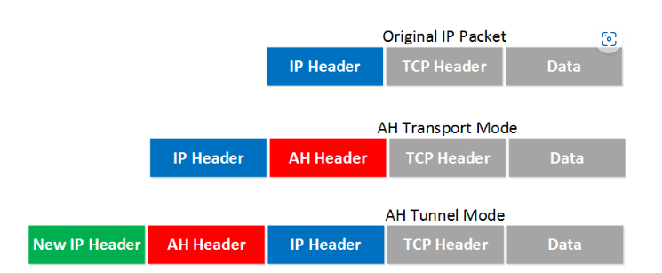

# IPSec fundamentals
## Overview
IPSec is a framework that helps us to protect IP traffic on the network layer. Normally, the IP protocol doesn't have security features. So IPSec was born to solve that problem. IPSec can protect our traffic with the following features: confidentiality, integrity, authentication, anti-replay. 

IPSec can be used on many diffenrent devices, it's used on routers, firewalls, hosts and servers. Some examples that we can use IPSec:

1. Between two routers to create a site-to-site VPN that "bridges" two LAN together. 
2. Between a firewall and windows host for remote access VPN.
3. Between two linux servers to protect an insecure protocol like telnet.

So how does IPSec work ?

Before protect any IP packets, IPSec need two peers that build the IPSec tunnel to establish an IPSec tunnel, we use a protocol called IKE (Internet Key Exchange).

There are 2 phases to build an IPSec tunnel: 

- In phase 1, two peers will negotiate about encryption, authentication, hasing and other protocols that they want to use and some other parameters that are required. In this phase, an **ISAKMP (Internet Security Association and Key Management Protocol)** session is established. This is also called the ISAKMP tunnel. The collection of parameters that the two devices will use is called a SA (Security Association)
- The IKE phase 1 tunnel is only used for management traffic. We use this tunnel as a secure method to establish the second tunnel called the IKE phase 2 tunnel or IPsec tunnel and for management traffic like keepalives. We have an IKE phase 2 tunnel that we can use to protect our user data.

**Note**: IKE build a tunnel for us but it doesn't authenticate or encrypt user data. To do this, we can use 2 other protocol for this: 

- **AH (Authentication Header)**
- **ESP (Encapsulating Security Payload)** -> The most popular choice (support encryption)

Both protocols support 2 different modes: Transport mode, Tunnel mode. Picture belows help you visualize the main difference between the two

Use cases: Transport mode is often between two devices that want to protect some insecure traffic (SSH). Tunnel mode is typically used for site-to-site VPN where we need to encapsulate the original IP packet since these are mostly private IP addresses and can't be routed on the Internet

So conclusion, IPSec consists 5 steps:

1. **Initiation:** Trigger the creation of tunnels. (read the configuration of router -> start the IKE processes). It also possible to manually initiate the tunnel.
2. **IKE phase 1** Negotiate a SA to build the IKE phase 1 tunnel
3. **IKE phase 2** we build the IKE phase 2 tunnel based on IKE phase 1 tunnel.
4. **Data transfer**
5. **Termination**

## Deep Dive 

After we have an idea of the basics of IPSec, let's take a closer look at each of the different components.

### IKE (Internet Key Exchange)

IKE is one of the primary protocols for IPsec since it establishes the security association between two peers. There are two versions of IKE:

- **IKEv1**
- **IKEv2**

There are some differences between the two versions:

- IKEv2 requires less bandwidth than IKEv1.
- IKEv2 supports EAP authentication (next to pre-shared-keys and digital certificates).
- IKEv2 has built-in support for NAT traversal(required when your IPsec peer is behind a NAT router).
- IKEv2 has a built-in keepalive mechanism for tunnels.
  
#### **IKE Phase 1**
   As we mentioned before, The main purpose of IKE phase 1 is to establish a secure tunnel that we can use for IKE phase 2.

   In detail, we can break down phase 1 in three simple step:

   1. **Negotiation**: To initiate the IKE negotiation. The two peers will negotiate about the following items:
     - Hasing: Hashing algorithms (SHA, MD5).
     - Authentication: to prove who peer is (pre-shared-key or digital certificates).
     - DH (Diffie Hellman) group: determines the strength of the key that is used in the key exchange process.
     - Lifetime: How long does the IKE phase 1 tunnel stand up ? 
     - Encryption: Encryption algorithms.

   2. **DH Key Exchange**: Both peers will have a shared key after this step.
   3. **Authentication**: Two peers will authenticate each other using the authentication method that they agreed upon on in the negotiation. The end result is a IKE phase 1 tunnel which is bidirectional. This means that both peers can send and receive on this tunnel.

   The three steps above can be completed using two different modes:
       - Main mode
       - Aggressive mode
##### **Main mode**

IKEv1 main mode uses 6 messages to establish a secure tunnel: 

**Message 1**

In message 1, we can see IKEv1 use UDP protocol (port 500) and some SA to negotiate other peer to create a tunnel. Otherwise, we can also see SPI(Secure Parameter Index) - an unique number that identifies for this SA.

**Message 2**

In message 2, after receive a SA from sender, receiver send a response packet that have SA in packet and Responder SPI to agree SA from sender.

**Message 3**

In message 3, after both peers agree SA, Sender start to initiate key exchange session using DH by send its key exchange data and nonce.
**Message 4**

In message 4, receiver receive key exchange packet and also send its key exchange data and nonce to the sender. 

**Message 5 and 6**

In message 5 and 6, it is authentication step. Both peers show who is it.

##### **Agressive mode**
In the agressive mode, there are only 3 messages which be sent. It’s quicker than main mode since it adds all the information required for the DH exchange in the first two messages. Main mode is considered more secure since identification is encrypted, aggressive mode does this in clear-text.

#### **IKE Phase 2**
The IKE phase 2 tunnel will be actually used to protect user data. There is only one mode to build the IKE phase 2 tunnel which is called quick mode.

Just like in IKE phase 1, our peers will negotiate about a number of items:

- IPsec Protocol
- Encapsulation mode
- Encryption
- Authentication
- Lifetime
- DH exchange (use for generate a new shared key).

### IPSec protocols: 
IPSec has 2 types of protocols: 
- AH (Authentication Header)
- ESP (Encapsulating Security Payload)
#### Authentication Header:
- AH offers authentication and integrity but it doesn't offer any encryption. It protects the IP packet by calculating a hash value over almost all fields in the IP header.
1. Transport mode 

As we can see AH is added in IP header and its has 4 fields:

   - Next Header: next header after AH.
   - AH SPI: an unique number to help receiver identify sender.
   - AH Sequence: this is the sequence number that helps against replay attacks.
   - ICV (Integrity Check Value): Calculate hase 

2. Tunnel Mode
With tunnel mode, we add a new IP header on top of the original packet. This could be useful when you are using private IP addresses and you need to tunnel your traffic over the internet.

#### Encapsulate Security Payload

ESP is the more popular choice of the two since it allows you to encrypt IP traffic. We can use it in transport or tunnel mode 

Packet that is captured by wireshark look similar in 2 mode. 

## Lab 
### Lab1: Create IPSec tunnel by VyOS

