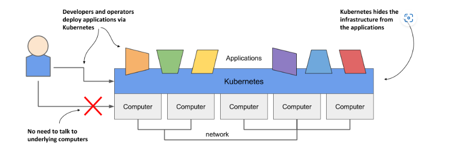
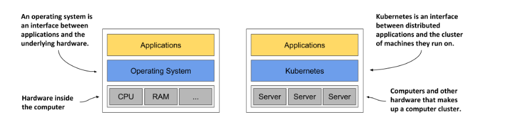
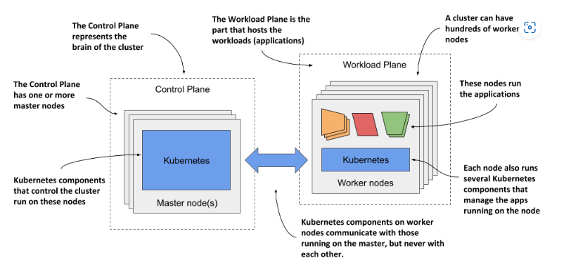
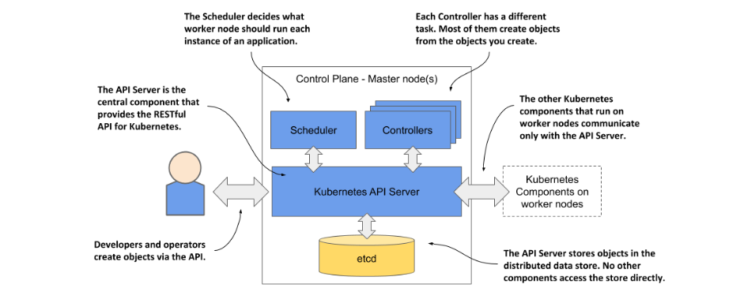
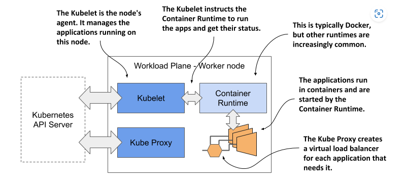
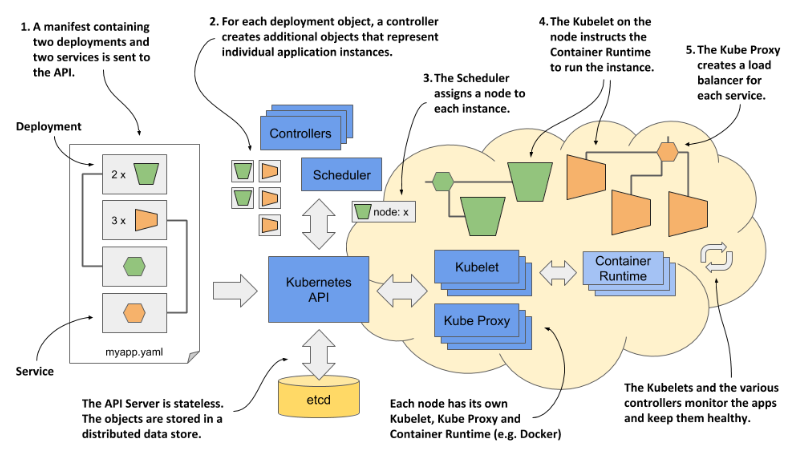
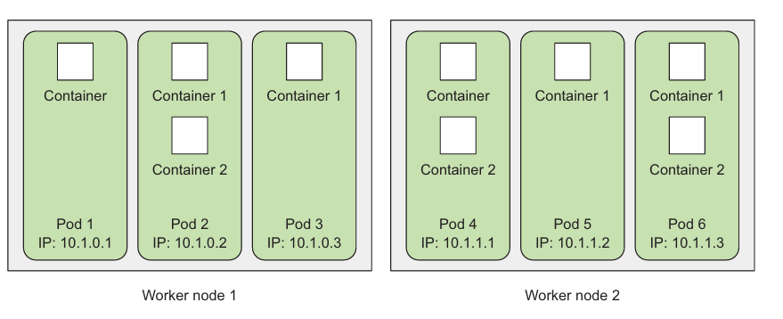
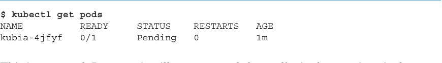

# Tìm hiểu về k8s
## Kubernetes in a nutshell
K8s là một phần mềm hệ thống thực hiện việc tự động deploy và quản lý những hệ thống phức tạp có tính mở rộng cao thường được chạy bằng các container. Khi một software developers hoặc operators quyết định deploy một ứng dụng nào đó, họ thường sử dụng k8s thay vì deploy ứng dụng đó trên máy tính riêng lẻ. K8s cung cấp một abstraction layer trên lớp hardware bên dưới cho cả user cũng như applications. Do đó khi muốn deploy hay vân quản lý các application người dùng chỉ cần tương tác với lớp abstraction này mà không cần quan tâm đến lớp hardware bên dưới. 

Khi một application được deploy trên k8s, ta chỉ cần phải cung cấp một file cấu hình về thiết kế của application đó sau đó K8s sẽ thực hiện việc deploy application đó dựa trên file cung cấp. Khi ta muốn thay đổi file cấu hình thì k8s cũng sẽ tự giúp ta reconfigure lại application đang chạy. Trong quá trình running của application, nó sẽ trải qua một số daily management được thực hiện bởi k8s. Nếu mà application fail thì k8s sẽ tự động restart lại, nếu hạ tầng phần cứng bên duoeis thay đổi thì application sẽ được chuyển sang một máy khác. K8s sẽ tự mình làm hết tất cả các việc đó. Có thể nói rằng: những software dev hay operator sẽ chỉ quan tâm đến những quyết định về high-level còn k8s sẽ chịu trách nhiệm về các tách vụ low-level liên quan đến hạ tầng
## Lý do ra đời của k8s
K8s được phát triển bởi Google. Vào khoảng đầu những năm 2014, một báo cáo đã chỉ ra rằng Google thực hiện chạy khoảng 2 tỉ container mỗi tuần và con số này có thể lớn hơn hiện nay. Những container này được chạy trên hàng nghìn máy tính ở các Data center trên toàn thế giới. Điều này đặt ra thách thức đối với các nhà vận hành nếu thực hiện vận hành các container một cách thủ công. Do đó K8s ra đời để giải quyết việc tự động hóa vận hành các container. 
## Tại sao k8s lại phổ biến ?
Trong quá trình hầu hết các application đều được phát triển theo mô hình monoliths. Các thành phần của một application được liên kết chặt chẽ với nhau và tất cả chúng đều chạy riêng trong một tiến trình máy tính. Việc này khiến cho việc scale theo chiều ngang gần như là không thể vì vậy khi muốn scale một application lên ta phải cung cấp thêm RAM và CPU cho máy tính đang host application hay còn gọi là scale theo chiều dọc (vertical scaling). 

Ngay sau đó sự ra đời của microservice đã thay đổi tất cả. Microservice thực hiện chia nhỏ mô hình monoliths ra thành hàng tá, thậm chí hàng trăm các process nhỏ. Mỗi một microservice được chia nhỏ ra từ application đều có một vòng đời phát triển và ra đời riêng.

Những phần riêng lẻ của một application không cần phải chạy trên cùng một host. Điều này khiến cho việc scaling trở nên dễ dàng. Tuy nhiên nó cũng có nghĩa là ta cần phải cấu hình để các máy tính có thể kết nối, nói chuyện được với nhau. Ngày nay, một hệ thống lớn thường có đến hàng trăm microservices. Khi mà một hệ thống bao gồm nhiều microservices, việc tự động hóa gần như là bắt buộc và K8s ra đời để làm việc này. 
## Kubernetes trong vai trò là một operating system cho computer clusters

Giống với một OS thông thường, thực hiện các tác vụ như là scheduling process, hoạt động như là một interface giữa hardware và application. K8s schedules cho các components của một distributed application trên các máy tính khác nhau và hoạt động như là một interface giữa application và cluster. 
## The architecture of a K8s cluster
Một K8s cluster bao gồm nhiều nodes được chia ra làm 2 groups:
1. Một set các master nodes host Control Plane components, được coi là bộ não của hệ thống giữ vai trò điều phối toàn bộ cluster.
2. Một set các worker nodes tạo thành Workload Plane component - nơi mà workload của application được thực hiện 


### Control Plane Components
Control Plane là thành phần đẻ quản lý cluster. Nó bao gồm một số thành phần được chạy trên một single master node hoặc được replicated ra làm nhiều master nodes với mục đích để HA. 

Sau đây là một số thành phần của control plane và chức năng của nó:
1. K8s API server exposes ra RESTful K8s API và người dùng có thể tương tác với K8S cluster thông qua API này
2. Etcd distributed datastored: có chức năng lưu trữ những object được tạo thông qua K8s API server và chỉ có K8s API server mới có thể tương tác với etcd
3. Scheduler có nhiệm vụ quyết định xem worker node nào mà application sẽ được chạy
4. Controller có tác vụ là tạo những object được yêu cầu qua API, nhưng cũng có một số trường hợp Controller có thể giao tiếp với external system.
### Worker node components:
Trong worker node có một số thành phần của K8s sẽ được chạy trên node này. Chúng thực hiện nhiệm vụ running, monitoring và cung cấp kết nối giữa những applications.

Mỗi một worker node sẽ chạy một set những components sau:
- Kubelet là một agent có thể giao tiếp với API server và quản lý applications chạy trên chính node đó. Nó báo cáo trạng thái của application và node thông qua API.
- Container Runtime, có thể là docker hoặc bất kỳ container runtime nào khác được hỗ trợ bởi K8s. Nó thực hiện việc chạy application trong container thông qua sự điều phối của Kubelet.
- K8s Service proxy: thực hiện việc loadbalance network traffic giữa các applications.
### How K8s runs an application
Trong K8s mọi thứ đều được nhìn dưới dạng một object. 


## Pod là gì ?
Trong K8s, pod là một nhóm gồm một hoặc nhiều những containers liên quan trực tiếp đến nhau và sẽ thường chạy cùng nhau ở trên cùng một worker node and cùng một Linux namespaces. Mỗi pod được coi như là một 'logical machine' với một địa chỉ IP riêng, hostname cũng như process riêng, có thể chạy một application riêng biệt. Application có thể là một process đơn lẻ, chạy trên một container hoặc nó có thể là một process chính của một application,....Tất cả các containers trong một pod sẽ xuất hiện để chạy trên cùng một 'logical machine', nếu một container khác pods hoặc chạy trên cùng một worker node thì cũng không thể chạy cùng container ở pods khác. 


Bởi vì ta không thể list được những containers riêng lẻ, vì chúng không phải là một objects có thể đứng được riêng lẻ trong K8s. Để liệt kê tất cả các pods ta sử dụng câu lệnh
```
kubectl get pods
```



Trong câu lệnh này ta có thể thấy các trường tên của pods, trong pod này có bao nhiêu container được thể hiện qua trường ready, trạng thái của pod thông qua trường STATUS. Để xem thêm thông tin chi tiết của một pod ta có thể dùng câu lệnh `kubectl describe pod`. Nếu pod bị stuck ở trạng thái Pending có thể là do K8s không thể pull được image từ registry. 

Với một pod đang chạy, làm sao để ta có thể kết nối với nó ?. Như ta đã biết từ trước mỗi pod có một IP riêng, IP này là internal trong cluster và không thể kết nối từ bên ngoài. Để khiến một pod có thể kết nối được từ bên ngoài, ta sẽ thực hiện expose nó thông qua service object. Ta sẽ thực hiện tạo service mang tên là 'Loadbalancer'. Bằng cách tạo một loadbalancer service, một external LB có thể được tạo và ta có thể kết nối tới pod thông qua public IP của LB. 
**Lưu ý:** Minikube không hỗ trợ LB services, vì thể service sẽ không bao giờ có được một external IP. Nhưng ta có thể kết nối service thông qua external port của nó.