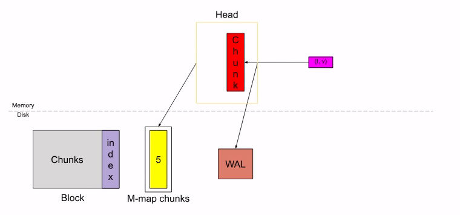

# How Prometheus TSDB Works
- Prometheus uses a pull model to collect data for the TSDB. We define scrape targets, usually exporters or instrumented services that expose '/metrics', and Prometheus polls them at fixed intervals. Inside the TSDB, new samples first land in an in-memory headblock. For every scrape, Prometheus appends the samples to the relevant time series in this head block and records them in a write-ahead log (WAL) on disk. The WAL lets prometheus replay recent data after a crash, so we dont lose the latest scrapes. Once enough data accumulates or a configured time window passes, Prometheus cuts a new block on disk that contains compressed chunks of samples, a label index, and metadata about the block time range. Background compaction then merges smaller blocks into larger ones to keep both storage usage and query performance under control.

## Components of TSDB:
### The Head Block:
- The Head Block is the in-memory part of the database and the grey block are persistent block on disk which are immutable. An incoming sample first goes to the head block and stays into the memory for a while, which is then flushed to the disk and memory-mapped (the blue box). And when these memory mapped chunks or the in-memory chunks get old to the certain point, they are flushed to the disk as persistent blocks.  Further multiple blocks are merged as they get old and finally deleted after they go beyond the retention period. 
- **m-map**(memory-mapped): is a POSIX-compliant system call that maps file or devices into the memory of a process. Functionally, it creates a correspondence between a segment of the process's virtual address space and a file on the disk -> So that the application can manipulated the file contents effectively as if they were an array in the primary memory, bypassing the traditional (call function `read` and `write` in system calls).
- In the headbloack, the samples are stored in compressed units called a 'chunk'. When a sample is incoming, it is ingested into the 'active chunk'. While committing the sample into the chunk, Prom also record it in the Write-Ahead-Log(WAL) on disk for durability. Once the chunk fills till 120 samples or spans up to chunk/block range -> a new chunk is cut and the old chunk is said to be "full". As soon as a new chunk is cut, the full chunk is flushed to the disk and memory-mapped from the disk while only storing a reference in the memory.
- When the data in the Head spans `chunkRange * 3/2`, the first chunkRange of data (2h here) is compacted into a persistent block -> So WAL is truncated at this point and a "checkpoint" is created.

# WAL and Checkpoint 

## WAL Basics:
- WAL is a sequential log of events that occur in a database. For whatever reason if the machine or the program decides to crash, you have the events recorded in this WAL which you can replay back in the same order to restore the data. This is particularly usefull for in-mem databases where if the database crashes, the entire data in the memory is lost if not for WAL. Prometheus has a WAL to provide durability for its Head block. In prometheus, WAL is only used to record the events and restore the in-mem state when starting up and does not involve in any other way in read or write operations. 